## Arduino RFID Keypad

*Quick disclaimer, this project is by no-means secure enough to secure valuables, use at your own risk. This is a proof of concept.*

Here's a security project designed with versatility in mind- it's inspired by our [LA5353 RFID Keypad](https://jaycar.com.au/p/LA5353) ,  but because it uses the[XC4630 LCD Touchscreen](https://jaycar.com.au/p/XC4630) , the setup of cards and users is a bit easier. As with most Arduino security stuff, it's pretty easy to bypass if you have physical access to the main board, so we wouldn't recommend using it for protecting valuables. Still, if you want to be able to activate a relay with either a card (most smartcards like public transport cards and bank cards will work with it) or a PIN code, this project fits the bill. There is some soldering required for this project.

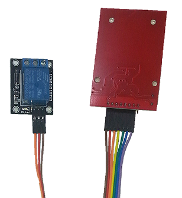

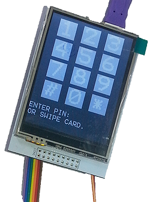

## Shopping List:

|Qty| Code | Description |
|---|---|---|
|1 | [XC4410](http://jaycar.com.au/p/XC4410) | Uno main board
|1 | [WC6028](http://jaycar.com.au/p/WC6028) | plug-socket jumper leads
|1 | [XC4506](http://jaycar.com.au/p/XC4506) | RFID reader kit
|1 | [XC4482](http://jaycar.com.au/p/XC4482) | Prototyping shield
|1 | [XC4419](http://jaycar.com.au/p/XC4419) | relay module
|1 | [XC4630](http://jaycar.com.au/p/XC4630) | 240x320 LCD touchscreen shield
|1 | [RR0596](http://jaycar.com.au/p/RR0596) | 10kOhm resistors

## Construction:

Most of the construction involves attaching the modules to the Prototyping Shield.  The RFID Module is a 3.3V device, so it some of its pins are connected to the Uno via 10KOhm resistors. The following connections are made on the Prototyping Shield:

|Uno|RFID Module|Relay Module|Function|Colour on RFID Module
|---|---|---|---|---
|3.3V|VVC||Power|Brown
|5V||+|Power|
|GND|GND|-|Ground|Orange
|D0|RST||Reset|Red
|A5||S|Relay Activate|
|D10|NSS (via 10kOhm)||Slave Select|Purple
|D11|MOSI (via 10kOhm)||Data from Uno|Green
|D12|MISO||Data to Uno|Yellow
|D13|SCK (via 10kOhm)||Serial Data Clock|Blue

Start by pushing a group of seven jumper leads onto the RFID module. You don't have to match the colours, but it might make it easier to follow our construction. Bend the end of the metal pins on the other end of the jumper leads to allow them to be soldered flat onto the Prototyping Shield.

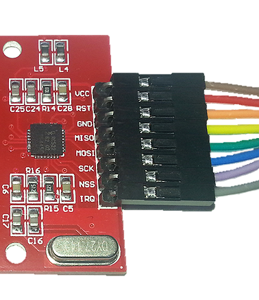

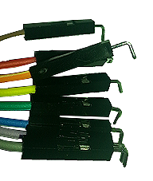

Solder the three resistors from D10, D11 and D13 on the Prototyping Shield to a nearby pad, and then solder the ends of the jumper wires into place.

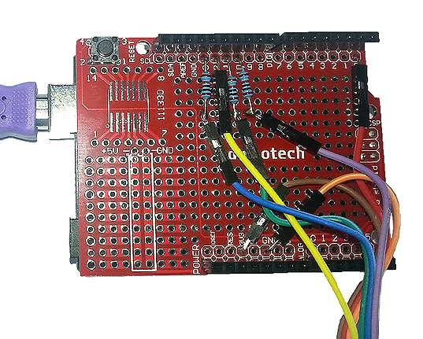

Similarly, push three jumper wires onto the Relay Module (S=Orange, +=Red, -=Black), then bend and solder to the correct pins on the Prototyping Shield:

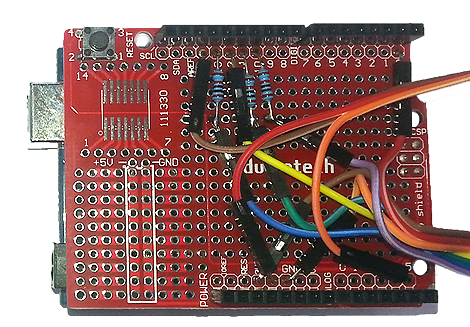

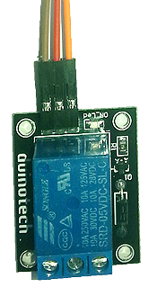

This is the most difficult part of construction completed. The only things left are to push the Prototyping Shield on top of the Uno, and then push the LCD Touchscreen Shield on top of the Prototyping Shield.

## Sketch:

There is only one external library needed for this project, and fortunately, there is one that can be installed via the Library Manager. Go to Sketch>Include Library>Manage Libraries and search for 'mfrc522'. There should be just one option- click on it, then click install. If you are using an older version of the IDE or can't get the Library Manager to install the library, there is a zipped version included with this project.

The main sketch itself is quite long, but most of this is actually for drawing on the screen. Where possible, it has been broken down into smaller functions to do different tasks- for example, the numeric keypad is the same in the setup as normal operation, just some extra text has been displayed to show what's happening on the page. The alphanumeric keyboard is implemented in the drawkeyboard() and checkkeyboard() function, both of which depend on the kb[] array to determine what keys are displayed and returned.

There are two files in the sketch folder - one of these is some functions for the LCD Touchscreen Shield, and the other is the main sketch. Make sure both these files are present when you open the sketch. There are two versions of the LCD Shield, and unfortunately, no easy way to tell them apart. There is a configuration define on the XC4630d.c tab (the second file in the sketch folder). Try commenting out one of the defines with "//" if your sketch doesn’t work:

```c
///#define XC4630_v1
//#define XC4630_v2
#define XC4630_v3
```

There is no configuration needed before uploading, so choose 'Uno' board and its corresponding serial port, and press 'Upload'. If everything is working, you should get the Master User Setup page. If you have a screen with a keypad, then the EEPROM may have some data left from a previous sketch which makes this sketch think it has been configured. If you need to erase the EEPROM, load the following sketch (and let it run for a few seconds), then reload the main sketch.

```c
#include <EEPROM.h>
void setup() {
	for(int i=0;i<EEPROM.length();i++){EEPROM.write(i,255);}
}

void loop() {
}
```

## Configuration and Use:

The Master User can have either a card or PIN for changing settings, but cannot activate the relay- this helps keep the use and settings separate. On the first run, choose a card or pin (or both- either can be used for access) to be used for changing settings, and follow the instructions. If you press cancel on both Master User options, then you can’t really do anything with it, and it will prompt for Master User settings next time it resets.

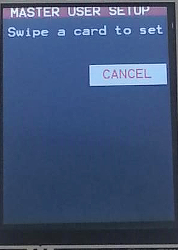

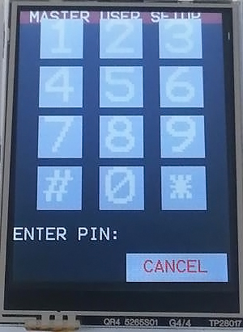

After the Master User setup, the screen will return to the normal idle state where it is waiting for someone to access it. If you swipe the 'Master' card or enter the 'Master' PIN, you can change the user setup, and set up cards and PINs for access.

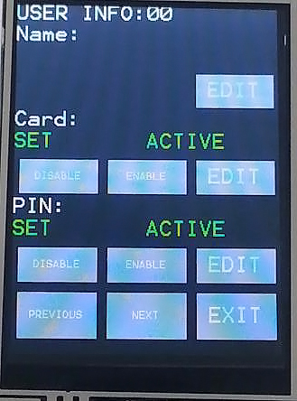

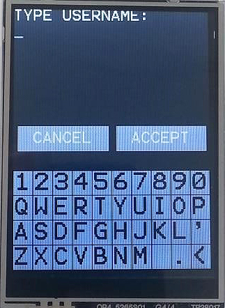

Each normal user (users 1-31) can have a name (up to 14 characters), a card (up to 8 bytes), and a PIN (from 4 to 8 numbers). When entering a PIN, # is used to erase the last character. Each individual user's card or PIN can activated or deactivated (for example, to temporarily disable access). The 'Previous' and 'Next' buttons can be used to scroll through the users, and 'Exit' is used when you wish to leave the settings. Cards and PINs cannot be duplicated between users (you'll get an error message if you try to set one the same as an existing one), because this might cause problems with users getting improper access.

On the main page, a PIN can be entered, or a card swiped, and if there is a match, an 'Unlock' message with the username will be displayed. If a non-matching card or PIN is offered, an error message will be given.

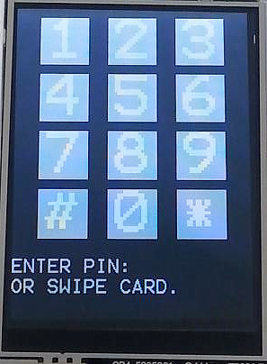

## Setting up a Door Strike:

You could use the Arduino RFID Keypad to operate a door strike like [LA5077](https://jaycar.com.au/p/LA5077) , and because it needs 12V, you could run both the Uno and door strike from the same power supply - the[MP3486](https://jaycar.com.au/p/MP3486) would be a good choice. We would recommend setting up the MP3486 to plug straight into the Uno (2.1mm plug with centre positive), and then run wire from the VIN pin to the NO contact on the relay, and then from the common (centre) contact on the relay to the door strike. Also run another wire from GND on the Uno to the other contact on the door strike.

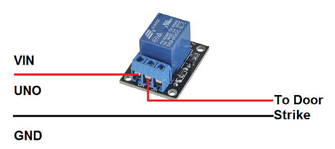

## Improvements:

There are two parameters which can be changed in the sketch are the number of users (USERCOUNT) and the time the relay is activated (RELAYTIME). The number of users can't be more than 32 for the Uno due to the space available in EEPROM, but you could reduce it to improve the security of the system. The relay time is in milliseconds, and should be adjusted to make sure that users have enough time to do what they need to do before the relay deactivates.

There are a few other things that can be changed in the sketch itself. The colour scheme is plain, but can be brightened up by doing a find/replace on the colour keywords- BLACK, GREY, WHITE etc (the colours that have been defined can be found in the XC4630.c file).

The keys on both the numeric and alphanumeric keyboards are set in arrays near the start of the sketch, so if you have a real need for different keys, these arrays can be changed. Just make sure to include `*` and `#` on the numeric keypad for enter and backspace, and `<` on the alphanumeric keypad for backspace.

If you find that where you want to mount the Arduino RFID Keypad would work better with the display rotated 180 degrees, then the line:

```c
XC4630_rotate(1);
```

Can be changed to:

```c
XC4630_rotate(3);
```

To flip it. Landscape arrangements are also possible, but the code would have to be rewritten to shuffle the graphics.

The Micro SD card slot on the LCD Touchscreen Shield is not usable, as the RFID Module uses the SPI pins. There is only one spare IO pin available - D1, so you could change NSS on the RFID module to D1 (both on the Prototyping Shield and in the sketch) if you wanted to use the Micro SD Card slot. Alternatively, you could connect a buzzer or piezo to D1 and have it generate tones to inform the users of what is happening.
